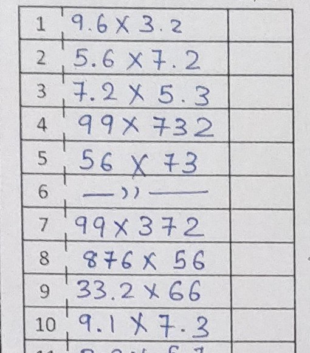

  
# A Box detection algorithm for tabularized data.

 - This code is used to extract data which is in tabular format using image processing techniques.
 - When you are working with Optical character recognition(OCR) or any data or object recognition problem, the first thing to do is preprocessing. 
 - Here preprocessing means to extract the box where our data is located. After extracting the boxes, any OCR algorithm can be performed on those crops for recognition.
 
 

 - The problem arises when you have to detect objects which are located  in any tables/boxes or in row-column format. If the image is like this then you have to detect boxes and extract them one by one.
Now it should be done accurately for all images.

  

This algorithm helps to detect every boxes accurately and save it in a `/Output/` folder. The code is shown in `src/box_detection.py`

**USAGE:**
 - Run `python src/box_detection.py`
 - You can see the output crops on `/Output` folder

 

You can also read the medium article for understanding about the algorithm: https://medium.com/@kananvyas/a-box-detection-algorithm-for-any-image-containing-boxes-756c15d7ed26